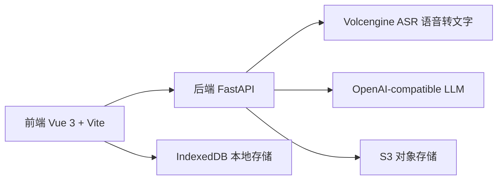
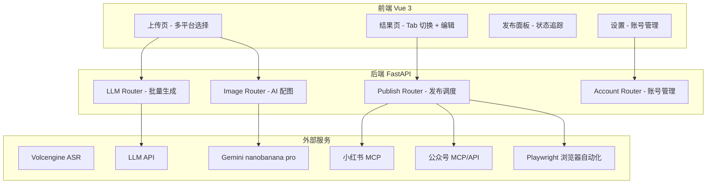
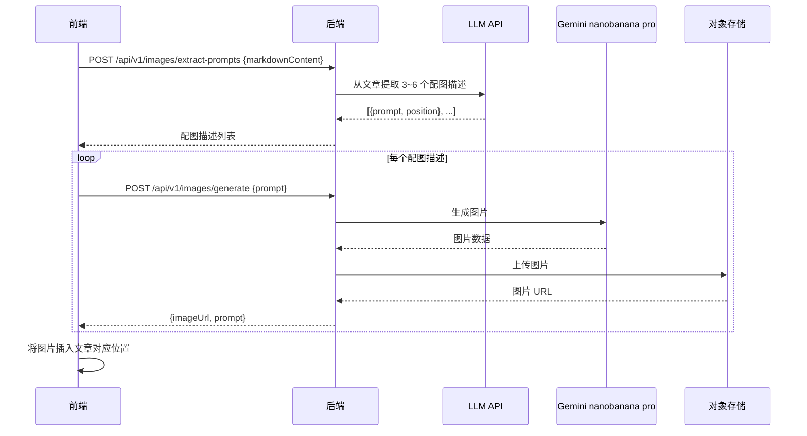
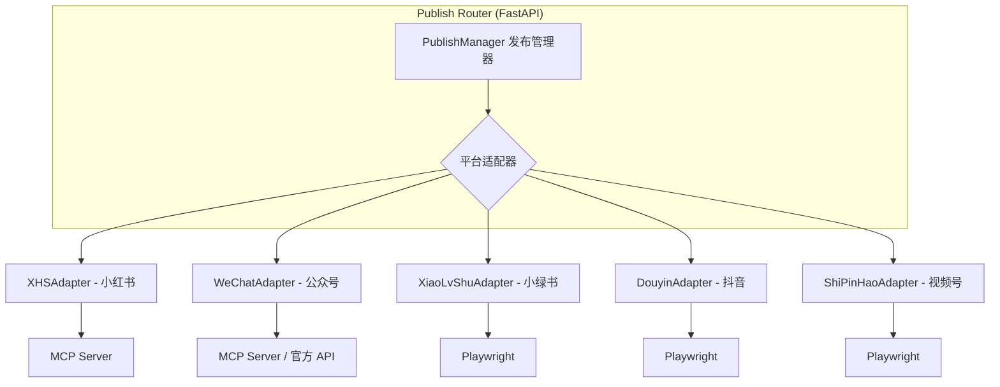

# AI-Media2Doc 功能改造 — 开发设计文档

## 1. 系统架构总览

### 1.1 现有架构



### 1.2 改造后架构



---

## 2. P0：多平台内容生成

### 2.1 概述

将现有的「单选风格」改为「多选目标平台」，一次上传支持同时为多个平台生成内容。

### 2.2 前端改动

#### [MODIFY] [UploadSection.vue](file:///Users/superfa/Documents/群晖同步/SynologyDrive/Superfa_project/AI-Media2Doc/frontend/src/components/VideoToMarkdown/UploadSection.vue)

**改动要点：**

- `el-radio-group` → `el-checkbox-group`，支持多选平台
- 新增平台选项：`xiaolvs`（小绿书）、`douyin`（抖音）、`shipinhao`（视频号）
- `emit('update:style', val)` → `emit('update:platforms', val)`，传递 `string[]`
- 视频类平台（抖音/视频号）选中时，提示"将发布原始视频 + AI 描述"

```diff
- const localStyle = ref(props.style || '')
+ const selectedPlatforms = ref<string[]>([])

- <el-radio-group v-model="localStyle" @change="handleStyleChange">
-   <el-radio-button v-for="item in styleList" :label="item.label">
+ <el-checkbox-group v-model="selectedPlatforms" @change="handlePlatformChange">
+   <el-checkbox-button v-for="item in platformList" :label="item.label">
```

**新增平台列表定义：**

```javascript
const platformList = [
  // 文字平台
  { label: 'xiaohongshu', name: '小红书', icon: '...', type: 'text' },
  { label: 'wechat', name: '公众号', icon: '...', type: 'text' },
  { label: 'xiaolvs', name: '小绿书', icon: '...', type: 'text' },
  // 视频平台
  { label: 'douyin', name: '抖音', icon: '...', type: 'video' },
  { label: 'shipinhao', name: '视频号', icon: '...', type: 'video' },
  // 工具类（保留原有）
  { label: 'note', name: '知识笔记', icon: '...', type: 'tool' },
  { label: 'summary', name: '内容总结', icon: '...', type: 'tool' },
  { label: 'mind', name: '思维导图', icon: '...', type: 'tool' },
]
```

#### [MODIFY] [index.vue](file:///Users/superfa/Documents/群晖同步/SynologyDrive/Superfa_project/AI-Media2Doc/frontend/src/components/VideoToMarkdown/index.vue)

**改动要点：**

- `style` ref → `platforms` ref (array)
- 第5步「生成图文」改为**循环调用每个平台的生成逻辑**
- 保存时每个平台生成独立的 task 记录，通过 `groupId` 关联
- 处理完成后跳转到新的多平台结果页

```javascript
// 核心变更：批量生成
const startProcessing = async () => {
  // ... 前4步不变 ...

  // 5. 为每个平台生成内容
  updateStepStatus(4, 'processing')
  const groupId = crypto.randomUUID()
  const results = {}

  for (const platform of platforms.value) {
    const md = await generateMarkdownText(
      processedText, platform, remarks.value, llmTimeout.value, llmMaxTokens.value
    )
    results[platform] = await processImageMarkers(md, file.value, ...)

    // 逐个保存 task
    await saveTask({
      fileName: fileName.value,
      md5: audioMd5,
      transcriptionText: transcriptionText.value,
      markdownContent: results[platform],
      contentStyle: platform,
      groupId: groupId,
      createdAt: new Date().toISOString()
    })
  }

  // 跳转到多平台结果页
  eventBus.emit('view-multi-task', { groupId, results })
}
```

#### [NEW] [MultiPlatformResult.vue](file:///Users/superfa/Documents/群晖同步/SynologyDrive/Superfa_project/AI-Media2Doc/frontend/src/components/VideoToMarkdown/MultiPlatformResult.vue)

**多平台结果页组件：**

- **Tab 布局**：每个平台一个 Tab，Tab 图标+名称
- **文字平台 Tab 内容**：
  - Markdown 渲染预览
  - "编辑"按钮 → 切换为 Markdown 编辑器
  - 配图预览区域
  - "发布到 XXX" 按钮
- **视频平台 Tab 内容**：
  - 视频预览播放器
  - 标题输入框
  - 描述文案编辑区
  - 标签/话题输入
  - "发布到 XXX" 按钮
- 底部：**"一键发布所有平台"** 按钮

#### [MODIFY] [TaskDetail.vue](file:///Users/superfa/Documents/群晖同步/SynologyDrive/Superfa_project/AI-Media2Doc/frontend/src/components/VideoToMarkdown/TaskDetail.vue)

- 增加对 `groupId` 的支持
- 如果是多平台任务组，展示 Tab 切换
- 单平台任务保持现有逻辑不变（向后兼容）

### 2.3 后端改动

#### [MODIFY] [constants.js](file:///Users/superfa/Documents/群晖同步/SynologyDrive/Superfa_project/AI-Media2Doc/frontend/src/constants.js)

新增平台 Prompt 模板：

```javascript
// 新增抖音视频描述 prompt
douyin: `你是一名资深抖音内容运营专家。根据以下视频内容的文字稿，生成适合抖音平台的视频标题、描述和话题标签。
要求：
1. 标题：15字以内，吸引眼球
2. 描述：100-200字，引发互动
3. 话题标签：5-8个热门相关话题，以#开头
4. 输出JSON格式：{"title": "...", "description": "...", "tags": ["#tag1", "#tag2"]}
<text_content>{content}</text_content>`,

// 新增视频号描述 prompt
shipinhao: `你是一名微信视频号内容运营专家。...`,

// 新增小绿书 prompt
xiaolvs: `你是一名微信小绿书内容创作者。请将下方内容转化为小绿书图文风格...`,
```

### 2.4 数据模型改动

#### [MODIFY] [db.js](file:///Users/superfa/Documents/群晖同步/SynologyDrive/Superfa_project/AI-Media2Doc/frontend/src/utils/db.js)

**IndexedDB 升级到 v2：**

```javascript
const dbVersion = 2

upgrade(db, oldVersion) {
  if (oldVersion < 1) {
    // v1 原有逻辑
    const taskStore = db.createObjectStore('tasks', { keyPath: 'id', autoIncrement: true })
    taskStore.createIndex('md5', 'md5', { unique: false })
    taskStore.createIndex('createdAt', 'createdAt', { unique: false })
    taskStore.createIndex('fileName', 'fileName', { unique: false })
    taskStore.createIndex('contentStyle', 'contentStyle', { unique: false })
    taskStore.createIndex('md5_contentStyle', ['md5', 'contentStyle'], { unique: true })
  }
  if (oldVersion < 2) {
    // v2 新增 groupId 索引
    const taskStore = db.transaction.objectStore('tasks')
    taskStore.createIndex('groupId', 'groupId', { unique: false })
  }
}
```

**新增查询方法：**

```javascript
// 按 groupId 获取一组多平台任务
export async function getTasksByGroupId(groupId) { ... }
```

**Task 数据结构扩展：**

```typescript
interface Task {
  id?: number
  fileName: string
  md5: string
  transcriptionText: string
  markdownContent: string
  contentStyle: string        // 平台标识
  groupId?: string            // 多平台任务组 ID（新增）
  publishStatus?: Record<string, PublishStatus>  // 发布状态（P2 新增）
  createdAt: string
}
```

### 2.5 后端无需改动

P0 阶段后端无需修改——现有的 `/api/v1/llm/markdown-generation` 接口已足够。前端循环调用即可实现多平台批量生成。

---

## 3. P1：AI 自动配图

### 3.1 概述

在文章生成后，通过 LLM 提取配图描述，调用 Gemini nanobanana pro 生成图片，插入文章。

### 3.2 配图流程



### 3.3 后端新增

#### [NEW] [backend/routers/images.py](file:///Users/superfa/Documents/群晖同步/SynologyDrive/Superfa_project/AI-Media2Doc/backend/routers/images.py)

```python
router = APIRouter(prefix="/images", tags=["Images"])

@router.post("/extract-prompts", response_model=APIResponse)
async def extract_image_prompts(request: MarkdownContentRequest):
    """从文章内容中提取配图描述"""
    # 调用 LLM 提取配图 prompts
    # 返回 [{prompt: str, insertAfter: str}, ...]

@router.post("/generate", response_model=APIResponse)
async def generate_image(request: ImageGenerateRequest):
    """调用 Gemini nanobanana pro 生成图片"""
    # 1. 调用 Gemini API 生成图片
    # 2. 上传到 S3
    # 3. 返回图片 URL
```

#### [NEW] [backend/utils/gemini.py](file:///Users/superfa/Documents/群晖同步/SynologyDrive/Superfa_project/AI-Media2Doc/backend/utils/gemini.py)

```python
import google.generativeai as genai

def generate_image(prompt: str) -> bytes:
    """调用 Gemini nanobanana pro 生成图片"""
    genai.configure(api_key=env.GEMINI_API_KEY)
    model = genai.GenerativeModel(env.GEMINI_IMAGE_MODEL)
    response = model.generate_content(prompt)
    # 提取图片数据
    return image_bytes
```

#### [MODIFY] [backend/env.py](file:///Users/superfa/Documents/群晖同步/SynologyDrive/Superfa_project/AI-Media2Doc/backend/env.py)

新增环境变量：

```python
GEMINI_API_KEY = os.getenv("GEMINI_API_KEY")
GEMINI_IMAGE_MODEL = os.getenv("GEMINI_IMAGE_MODEL", "gemini-3-pro-image-preview")
```

#### [MODIFY] [backend/models.py](file:///Users/superfa/Documents/群晖同步/SynologyDrive/Superfa_project/AI-Media2Doc/backend/models.py)

新增请求模型：

```python
class MarkdownContentRequest(BaseModel):
    content: str
    count: Optional[int] = 4  # 期望配图数量

class ImageGenerateRequest(BaseModel):
    prompt: str
    aspect_ratio: Optional[str] = "16:9"
```

#### [MODIFY] [backend/app.py](file:///Users/superfa/Documents/群晖同步/SynologyDrive/Superfa_project/AI-Media2Doc/backend/app.py)

注册新路由：

```python
from routers import llm, files, audio, secrets, images

app.include_router(
    images.router, prefix="/api/v1",
    dependencies=[Depends(verify_web_access_password)]
)
```

### 3.4 前端改动

#### [NEW] [frontend/src/apis/imageService.ts](file:///Users/superfa/Documents/群晖同步/SynologyDrive/Superfa_project/AI-Media2Doc/frontend/src/apis/imageService.ts)

```typescript
// 从文章提取配图描述
export const extractImagePrompts = async (content: string, count?: number) => { ... }

// 生成单张配图
export const generateImage = async (prompt: string) => { ... }
```

#### [MODIFY] [UploadSection.vue](file:///Users/superfa/Documents/群晖同步/SynologyDrive/Superfa_project/AI-Media2Doc/frontend/src/components/VideoToMarkdown/UploadSection.vue) 或 Settings

- 在配图方式设置增加选项：`智能截图` / `AI 配图` / `智能截图 + AI 配图`

#### [NEW] [frontend/src/components/Settings/SettingsImageGen.vue](file:///Users/superfa/Documents/群晖同步/SynologyDrive/Superfa_project/AI-Media2Doc/frontend/src/components/Settings/SettingsImageGen.vue)

AI 配图设置面板：
- 配图方式选择（截图 / AI / 两者）
- 配图数量（3~6）
- 图片风格偏好（可选）

---

## 4. P2：多平台自动发布

### 4.1 架构设计



### 4.2 后端新增

#### [NEW] [backend/routers/publish.py](file:///Users/superfa/Documents/群晖同步/SynologyDrive/Superfa_project/AI-Media2Doc/backend/routers/publish.py)

```python
router = APIRouter(prefix="/publish", tags=["Publish"])

@router.post("/tasks", response_model=APIResponse)
async def create_publish_task(request: PublishRequest):
    """创建发布任务"""
    # 异步执行发布逻辑
    task_id = publish_manager.submit(request)
    return success_response(data={"task_id": task_id})

@router.get("/tasks/{task_id}", response_model=APIResponse)
async def get_publish_status(task_id: str):
    """查询发布状态"""
    status = publish_manager.get_status(task_id)
    return success_response(data=status)

@router.post("/tasks/{task_id}/retry", response_model=APIResponse)
async def retry_publish(task_id: str, platform: str):
    """重试失败的发布"""
```

#### [NEW] [backend/publish/](file:///Users/superfa/Documents/群晖同步/SynologyDrive/Superfa_project/AI-Media2Doc/backend/publish/) 发布模块

```
backend/publish/
├── __init__.py
├── manager.py          # PublishManager 发布调度管理器
├── base.py             # BaseAdapter 抽象基类
├── adapters/
│   ├── __init__.py
│   ├── xiaohongshu.py  # 小红书 MCP 适配器
│   ├── wechat.py       # 公众号 MCP/API 适配器
│   ├── xiaolvshu.py    # 小绿书 Playwright 适配器
│   ├── douyin.py       # 抖音 Playwright 适配器
│   └── shipinhao.py    # 视频号 Playwright 适配器
└── models.py           # 发布相关数据模型
```

**BaseAdapter 抽象基类：**

```python
from abc import ABC, abstractmethod

class BaseAdapter(ABC):
    @abstractmethod
    async def validate_account(self, credentials: dict) -> bool:
        """验证账号是否有效"""

    @abstractmethod
    async def publish_text(self, content: str, images: list[str], **kwargs) -> PublishResult:
        """发布图文内容"""

    @abstractmethod
    async def publish_video(self, video_path: str, title: str, description: str, tags: list[str]) -> PublishResult:
        """发布视频内容"""
```

**PublishManager 核心逻辑：**

```python
class PublishManager:
    def __init__(self):
        self.adapters = {
            'xiaohongshu': XiaohongshuAdapter(),
            'wechat': WeChatAdapter(),
            'xiaolvs': XiaoLvShuAdapter(),
            'douyin': DouyinAdapter(),
            'shipinhao': ShiPinHaoAdapter(),
        }
        self.tasks = {}  # task_id -> PublishTask

    async def submit(self, request: PublishRequest) -> str:
        task_id = str(uuid.uuid4())
        task = PublishTask(task_id, request)
        self.tasks[task_id] = task
        asyncio.create_task(self._execute(task))
        return task_id

    async def _execute(self, task: PublishTask):
        for platform in task.platforms:
            adapter = self.adapters[platform]
            try:
                task.update_status(platform, 'publishing')
                if adapter.content_type == 'video':
                    result = await adapter.publish_video(...)
                else:
                    result = await adapter.publish_text(...)
                task.update_status(platform, 'success', result)
            except Exception as e:
                task.update_status(platform, 'failed', error=str(e))
```

#### [NEW] [backend/routers/accounts.py](file:///Users/superfa/Documents/群晖同步/SynologyDrive/Superfa_project/AI-Media2Doc/backend/routers/accounts.py)

```python
router = APIRouter(prefix="/accounts", tags=["Accounts"])

@router.get("/", response_model=APIResponse)
async def list_accounts():
    """获取所有已配置的平台账号（脱敏）"""

@router.post("/", response_model=APIResponse)
async def add_account(request: AccountRequest):
    """添加平台账号"""

@router.delete("/{platform}", response_model=APIResponse)
async def remove_account(platform: str):
    """删除平台账号"""

@router.post("/{platform}/validate", response_model=APIResponse)
async def validate_account(platform: str):
    """验证账号有效性"""
```

### 4.3 前端新增

#### [NEW] [frontend/src/components/Settings/SettingsAccounts.vue](file:///Users/superfa/Documents/群晖同步/SynologyDrive/Superfa_project/AI-Media2Doc/frontend/src/components/Settings/SettingsAccounts.vue)

账号管理设置页：
- 各平台 Cookie/凭证输入
- 扫码登录引导（参考 social-auto-upload）
- 账号状态验证

#### [NEW] [frontend/src/components/VideoToMarkdown/PublishPanel.vue](file:///Users/superfa/Documents/群晖同步/SynologyDrive/Superfa_project/AI-Media2Doc/frontend/src/components/VideoToMarkdown/PublishPanel.vue)

发布面板：
- 各平台发布状态卡片（排队中 / 发布中 / 成功 / 失败）
- 失败重试按钮
- 发布结果链接跳转

#### [NEW] [frontend/src/apis/publishService.ts](file:///Users/superfa/Documents/群晖同步/SynologyDrive/Superfa_project/AI-Media2Doc/frontend/src/apis/publishService.ts)

```typescript
export const submitPublishTask = async (platforms: string[], contents: Record<string, any>) => { ... }
export const getPublishStatus = async (taskId: string) => { ... }
export const retryPublish = async (taskId: string, platform: string) => { ... }
```

---

## 5. 新增/修改文件总览

### 后端 (Python)

| 操作 | 文件路径 | 说明 |
|------|---------|------|
| MODIFY | `backend/env.py` | 新增 Gemini API 环境变量 |
| MODIFY | `backend/models.py` | 新增请求模型 |
| MODIFY | `backend/app.py` | 注册新路由 |
| NEW | `backend/routers/images.py` | AI 配图路由 |
| NEW | `backend/routers/publish.py` | 发布路由 |
| NEW | `backend/routers/accounts.py` | 账号管理路由 |
| NEW | `backend/utils/gemini.py` | Gemini API 封装 |
| NEW | `backend/publish/` | 发布模块（manager + adapters） |

### 前端 (Vue 3 / TypeScript)

| 操作 | 文件路径 | 说明 |
|------|---------|------|
| MODIFY | `frontend/src/constants.js` | 新增平台 Prompt 模板 |
| MODIFY | `frontend/src/apis/types.ts` | 扩展 Task 类型 |
| MODIFY | `frontend/src/utils/db.js` | IndexedDB v2 升级 |
| MODIFY | `frontend/src/components/VideoToMarkdown/UploadSection.vue` | 单选→多选 |
| MODIFY | `frontend/src/components/VideoToMarkdown/index.vue` | 批量生成逻辑 |
| MODIFY | `frontend/src/components/VideoToMarkdown/TaskDetail.vue` | 支持多平台 Tab |
| MODIFY | `frontend/src/components/Settings/Settings.vue` | 新增设置 Tab |
| MODIFY | `frontend/src/App.vue` | 路由/导航适配 |
| NEW | `frontend/src/components/VideoToMarkdown/MultiPlatformResult.vue` | 多平台结果页 |
| NEW | `frontend/src/components/VideoToMarkdown/PublishPanel.vue` | 发布面板 |
| NEW | `frontend/src/components/Settings/SettingsAccounts.vue` | 账号管理 |
| NEW | `frontend/src/components/Settings/SettingsImageGen.vue` | AI 配图设置 |
| NEW | `frontend/src/apis/imageService.ts` | 配图 API 服务 |
| NEW | `frontend/src/apis/publishService.ts` | 发布 API 服务 |

---

## 6. 依赖新增

### 后端 Python

```
google-generativeai    # Gemini nanobanana pro
playwright             # 浏览器自动化（抖音/视频号/小绿书）
mcp                    # MCP 客户端（小红书/公众号）
cryptography           # 账号凭证加密存储
```

### 前端 NPM

```
md-editor-v3           # Markdown 编辑器（内容编辑）
```

---

## 7. 分阶段开发计划

### Phase 1：P0 多平台内容生成（预计 3-5 天）

1. 前端：`UploadSection.vue` → 多选改造
2. 前端：`constants.js` → 新增平台 Prompt
3. 前端：`index.vue` → 批量生成逻辑
4. 前端：`db.js` → v2 升级 + groupId
5. 前端：`MultiPlatformResult.vue` → 结果页 Tab 切换
6. 前端：`TaskDetail.vue` → 兼容单/多平台

### Phase 2：P1 AI 自动配图（预计 2-3 天）

1. 后端：`utils/gemini.py` → Gemini API 封装
2. 后端：`routers/images.py` → 配图路由
3. 前端：`imageService.ts` → 配图 API
4. 前端：`SettingsImageGen.vue` → 配图设置
5. 前端：集成配图到内容生成流程

### Phase 3：P2 多平台自动发布（预计 5-7 天）

1. 后端：`publish/` 模块 → 适配器架构
2. 后端：小红书 MCP 适配器
3. 后端：公众号 MCP/API 适配器
4. 后端：Playwright 适配器（抖音/视频号/小绿书）
5. 后端：`routers/accounts.py` → 账号管理
6. 前端：`SettingsAccounts.vue` → 账号设置 UI
7. 前端：`PublishPanel.vue` → 发布面板 UI
8. 前端：`publishService.ts` → 发布 API

---

## 8. 验证方案

### 8.1 P0 验证

- 上传视频，选择多个平台（如小红书 + 公众号 + 知识笔记）
- 验证各平台内容独立生成、Tab 切换正常
- 验证 IndexedDB 数据正确（groupId 关联）
- 验证历史任务回看兼容旧数据

### 8.2 P1 验证

- 配置 Gemini API Key
- 上传视频生成文章后触发 AI 配图
- 验证配图数量和位置正确
- 验证配图与智能截图可共存

### 8.3 P2 验证

- 配置测试账号 Cookie
- 发布到小红书测试（MCP 方案）
- 发布到抖音测试（Playwright 方案）
- 验证发布状态追踪、失败重试
- 验证并发发布稳定性
